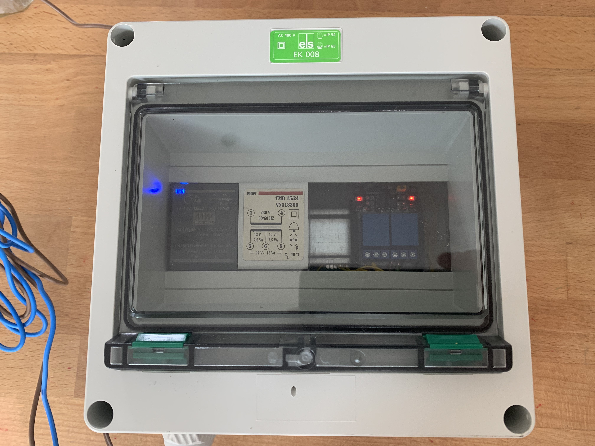
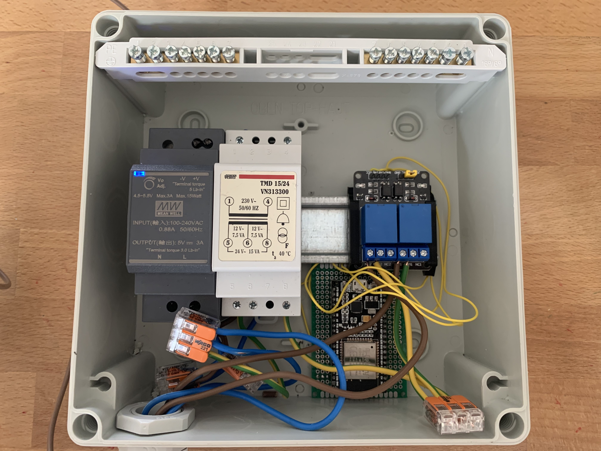

# ESP32-sprinkler

An ESP32 connected over wifi with a web interface and a connection to a MQTT to control the valves of two garden sprinklers.

The code is heavily borrowed from [bugfx/ESP32-sprinkler-controller](https://github.com/bugfx/) and is hopefully going to be extended over time. For now, I've done some smaller tweaks and added an [esp-dash](https://github.com/ayushsharma82/ESP-DASH) dashboard to trigger the valves directly via the ESP.

## hardware

- [Case (Ritter Feuchtraum Aufputz Kleinverteiler, 8 TE)](https://www.rev.de/DE_produkt_6433.ahtml)
- [Universal DIN rail mount for relay](https://www.thingiverse.com/thing:3441147/files)
- [ESP32](https://www.az-delivery.de/en/products/esp32-developmentboard)
- [2 channel relay board](https://www.az-delivery.de/en/products/2-relais-modul)

## mqtt

There are two MQTT topics for each valve. The state topic is set by the ESP32 to report the status of the valve back to the server.

## connections and credential-files

The ESP32 connects to a standard WPA2 wifi network. Network id and password are defined in a separate file that has to be included in the main sketch.
